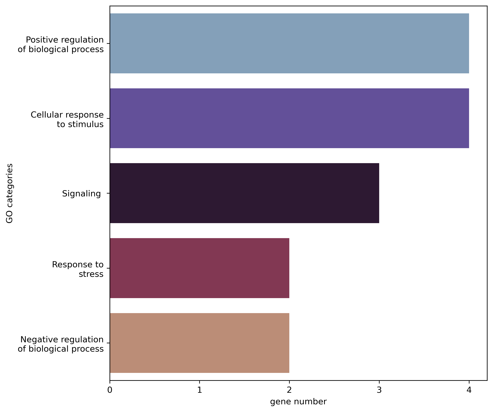

# The analysis of epistatic SNP interactions using **AntEpiSeeker** algorithm 🐜

## AntEpiSeeker algorithm

**Ant colony algorithms**, first proposed by Dorigio and Gambardella[^1], are tools for solving difficult optimisation problems such as the travelling salesman problem. 
ACO simulates how real ant colonies find the shortest route to a food source. In ACO, artificial ants work as parallel units that are controlled by a probability distribution function (PDF). 
distribution function (PDF), which is updated by weights or pheromones. The change in pheromones is determined by some kind of expert knowledge. As the PDF is updated, 
"paths" that perform better are sampled at higher rates by subsequent artificial ants, which in turn deposit more pheromones.

[AntEpiSeeker](http://nce.ads.uga.edu/~romdhane/AntEpiSeeker/index.html) has been developed to search for epistatic interactions in large-scale association studies[^2].
The *first stage* of **AntEpiSeeker** searches SNP sets of sufficient size (larger than the number of SNPs in a given epistatic interaction) using the ACO, which results 
in a pre-defined number of highly suspected SNP sets determined by $\chi^2$ scores, and another SNP set of a pre-defined size, determined by pheromone levels. 
On the *second stage* **AntEpiSeeker** conducts exhaustive search of epistatic interactions within the highly suspected SNP sets, and within the reduced set of SNPs with
top ranking pheromone levels. Additionally, the authors suggest two rounds of search: 1) using a relatively large size SNP set, which is sensitive to strong signals, and 2) 
using a relatively small size SNP set, which is sensitive to weak signals.

The main idea of the ACO is shown in the figure bellow:


*Note*: For more information about `AntEpiSeeker` see the [Jupyter Notebooks](./source) with our analysis, [the authors' article](https://bmcresnotes.biomedcentral.com/articles/10.1186/1756-0500-3-117) and their [website](http://nce.ads.uga.edu/~romdhane/AntEpiSeeker/index.html).

## System and requirements

This analysis was performed on Ubuntu 20.04.5 LTS with Python 3.9.13. Also, [VCFtools](https://vcftools.github.io/examples.html) v0.1.16, [BEDTools](https://anaconda.org/bioconda/bedtools) v2.30.0, [BEAGLE](http://faculty.washington.edu/browning/beagle/beagle.html) v5.4, and [AntEpiSeeker](http://nce.ads.uga.edu/~romdhane/AntEpiSeeker/index.html) v1.0 should be installed. Required Python packages and their versions listed in [requirements.txt](./requirements.txt).

## Folders

There are **nine folders** and some of their decription:

1) [Pictures](./Pictures): contains pictures used in this README.md;
2) [ala_med_input](./ala_med_input): contains `AntEpiSeeker` input file for Alanine content dataset and file for its generation;
3) [ala_two_loci][./ala_two_loci] and [ala_three_loci](./ala_three_loci): contain files required or generated during analysis of *Alanine content dataset* in two-loci and three-loci interaction mode, respectively. For example, there are `AntEpiSeeker` outputs, and generated for and after genome assembly remapping, SNP annotation, enrichment analysis, *etc.*;
4) [ant_parameters](./ant_parameters): contains `parameters.txt` files for running `AntEpiSeeker` for both datasets and interaction modes;
5) [secret_two_loci](./secret_two_loci) and [secret_three_loci](./secret_three_loci): contain files required or generated during analysis of *Commercial content dataset* in two-loci and three-loci interaction mode, respectively. For example, there are `AntEpiSeeker` outputs, and generated for and after SNP annotation, enrichment analysis, *etc.*;
6) [source](./source): contains *Jupyter Notebooks* with detailed and commented analysis of both datasets, and `.py` script with useful for this analysis functions

## AntEpiSeeker parameters

The parameters needed to run AntEpiseeker include *iAntCount*, *iItCountLarge*, *iItCountSmall*, $\alpha$ , *iTopModel*, *iTopLoci*, $\rho$ , $\tau0$, *largesetsize*, 
*smallsetsize*, *iEpiModel*, *pvalue*, *input* and *output* files. Briefly, some of their descripion:

1) `iEpiModel` specifies the number of SNPs in an epistatic interaction - 2 or 3;
2) `largesetsize`, `smallsetsize` must be greater than *iEpiModel*. For a **two-locus** interaction model, the authors suggest $largesetsize = 6$, $smallsetsize = 3$, $iEpiMode = 2$. 
For a **three-locus** interaction model, they suggest $largesetsize = 6$, $smallsetsize = 4$, $iEpiModel = 3$;
3) `iItCountLarge`, `iItCountSmall` should be chosen according to the number of SNPs genotyped in the data (denoted by $L$). Typically, the authors suggest $iItCountSmall ≥ 0.1 \cdot L$ and 
$iItCountLarge = 0.5 \cdot iItCountSmall$.
4) `iAntCount` may vary from 500 to 5,000, where larger `iAntCount` should correspond to larger L. 
5) $\rho$ should range from 0.01 to 0.1 for better performance, where smaller $L$ should use larger $\rho$. 

For our analysis we mainly used **the default parameters** suggested by the authors. The authors noted that these parameters were used in most simulation studies, and were an optimal setting balanced between $\rho$ and `iAntCount`, which should work well on medium size datasets ($2 \cdot 10^3 \leq L \leq 2 \cdot 10^4$). We only adjusted `iItCountLarge`, `iItCountSmall` and the input and output file paths as described in this section.

## Input files

The **input** file should consist of genotype in *"012"* format, the last columns should contain binary phenotype and should be comma-delimited. Unfortunately, only qualitative phenotypes could be analyzed with this utility. To tackle this obstacle, we converted quantitative phenotypes into binary via calculating the median value and assigning “0” for samples with the value less than median and “1” in the opposite case. The input example is shown below:

| **SNP1** | **SNP2** | **SNP3** | **SNP4** | **SNP5** | **SNP6** | **class** |
|:----:|:----:|:----:|:----:|:----:|:----:|:-----:|
|  2   |  1   |  0   |  2   |  0   |  2   |   1   |
|  1   |  2   |  1   |  2   |  2   |  0   |   1   |
|  0   |  1   |  1   |  0   |  2   |  1   |   0   |
| ...  | ...  | ...  | ...  | ...  | ...  |  ...  |

The *input* file is organised in this way:

1) *row* for each sample;
2) *column* for each SNP;
3) *genotypes encoded in "012"*, where the number represent that number of non-reference alleles. Missing genotypes are represented by -1;
4) the last "class" column stand for *phenotype* (usually discrete 0/1);
5) file should be comma-delimited

## Preparation for run

For analysis, we selected the **alanine phenotype** among the amino acid data and commercial dataset with some complex trait. For running `AntEpiSeeker`, we transformed [.vcf file](./data/soybean_aa_genotypes.vcf) with genotypes to *012* using `VCFtools` v0.1.16[^3] and the following command:

- for *Alanine content dataset*:

```
$ vcftools --vcf ../../data/soybean_aa_genotypes.vcf --012 --out ../ala_med_input/soybean_aa_genotypes
```

- for *Commercial dataset*:

```
$ vcftools --gzvcf ../../data/commercial_genotypes_snps_filled.vcf.gz --012 --out ../secret_med_input/commercial_genotypes_snps_filled
```

As the result, three files were be generated:

1) `.012.indv`: file with sample names;
2) `.012.pos`: file with SNP coordinates;
3) `.012`: file with genotype in *012* format

The described files can be found in these folders: [ala_med_input](./ala_med_input) and [secret_med_input](./secret_med_input).

Next, we combined *012* genotype with generated SNP names in format *chrN:position* and phenotype data. Also, we were convinced of the absence of omissions in the genotype. We have prepared files with parameters. This files could be found in [this folder](./ant_parameters). Before running the tool, each file with parameters **should be renamed as** `parameters.txt`.

| **Parameter**                              |     **Value**     | **Description**                                              |
|--------------------------------------------|:-----------------:|--------------------------------------------------------------|
| iAntCount                                  |        1000       | number of ants                                               |
| iItCountLarge<br> -Ala<br> -secret         |  <br>735<br>14616 | number of iterations for the large haplotypes                |
| iItCountSmall<br> -Ala<br> -secret         | <br>1470<br>29231 | number of iterations for the small haplotypes                |
| alpha                                      |         1         | weight given to pheromone deposited by ants                  |
| iTopModel                                  |        1000       | number of top ranking haplotypes in the first stage          |
| iTopLoci                                   |        200        | number of loci with top ranking pheromone in the first stage |
| rou                                        |        0.05       | evaporation rate in Ant Colony Optimizaion                   |
| phe                                        |        100        | initial pheromone level for each locus                       |
| largehapsize                               |         6         | size of the large haplotypes                                 |
| smallhapsize<br> -two-loci<br> -three-loci |     <br>3<br>4    | size of the small haplotypes                                 |
| iEpiModel<br> -two-loci<br> -three-loci    |     <br>2<br>3    | number of SNPs in an epistatic interaction                   |
| pvalue                                     |        0.01       | p value threshold (after Bonferroni correction)              |
| INPFILE                                           |     ../ala_med_input/soybean012_ala_med.csv    | input file name for case-control genotype data               |
| OUTFILE                                           |    ../ala_two_loci/ant_result_Ala_med.txt    | output file name for detected epistatic interactions         |

*Note*: this is an example of `parameters.txt`. You should move it into directory with `AntEpiSeeker`, specify the path for input and output files, and rename it as `parameter.txt`.

### *Glycine max* genome annotations

Genome annotations are in [annotations](./annotations) folder. Prior to run intersection, you need to unzip annotation file (i.e. using `gunzip`) in folder with `.bed` file. For alanine content dataset and commercial datasets, we used genome annotations from [NCBI](https://www.ncbi.nlm.nih.gov/assembly/GCF_000004515.5/) and [EnsemblPlants](https://plants.ensembl.org/Glycine_max/Info/Index), respectively.

## Running AntEpiSeeker

The C++ LINUX version of **AntEpiSeeker** program can be downloaded by [this link](http://nce.ads.uga.edu/~romdhane/AntEpiSeeker/AntEpiSeeker1.0_linux.zip). Recompiling tips could be found [here](http://nce.ads.uga.edu/~romdhane/AntEpiSeeker/recompile.txt). The compiled program file could be run as simple as `./AntEpiSeeker`. During execution, the program uses prepared `parameters.txt` file.

As a result, three output files will be generated by **AntEpiSeeker**:

1) `AntEpiSeeker.log` with the intermediate results including detected top ranked SNP sets and the loci with top pheromone levels;
2) `Results_maximized.txt` records all detected epistatic interactions with significant user-defined $p-value$ threshold (after the Bonferroni correction);
3) i.e. [ant_result_Ala_med.txt](./ala_two_loci/ant_result_Ala_med.txt) is the result file specified by the user in the parameter file reports the detected epistatic interactions with minimized false positives.

## AntEpiSeeker workflow

The major workflow consists of these steps and were performed in Jupyter Notebook. Notebooks can be found [here](./source):

- parsing AntEpiSeeker output file with **SNP pairs or triplets** and the $\chi^2$ values;
- annotating found SNPs and mapping them on genes using intersection with genome annotation file;
- parsing and filtering the resulted file with genome features for keeping only gene loci;
- analysing resulted interacting genes using GO, KEGG enrichment analysis etc.

### SNP Annotation

In the case of alanine phenotype, before generating file with coordinates we added and substract 500 basepairs from SNP coordinates and remapped them to **genome assembly v2.1** using [NCBI Feature remapping](https://www.ncbi.nlm.nih.gov/genome/tools/remap)[^4]. We also assigned the RefSeq ID to the chromosome names as in the annotation file. Then we generated `.bed` files with their coordinates for both phenotypes. The example `.bed` file is shown below:

| **chromosome** | **start** | **stop** |    **SNP_ID**   |
|:--------------:|:---------:|:--------:|:---------------:|
| NC_016088.3    |  46191324 | 46192324 | chr_01:45320366 |
| NC_016088.3    |   981275  |  982275  | chr_01:981476   |
| NC_038245.1    |  42889006 | 42890006 | chr_09:40211862 |
| NC_038241.1    |   795502  |  796502  | chr_05:8324954  |
| NC_038253.1    |  12188095 | 12189095 | chr_17:12450639 |
| ...            | ...       | ...      | ...             |

We performed genomic coordinates intersection using `BEDTools` v2.30.0 [^5] with the following command and `-wao` parameters for keeping all information from both of the files:

- for *Alanine content dataset*:

```
$ bedtools intersect -wao -a ant_ala_snp_coords_v21.bed -b GCF_000004515.5_Glycine_max_v2.1_genomic.gff.gz > ../ant_ala_two_features/ala_two_loci_itersect.txt
```

- for *Commercial dataset*:

```
$ bedtools intersect -wao -a ../secret_two_loci/ant_secret_coords/secret_ant_unique_snps.bed \
-b ../../annotations/Glycine_max.Glycine_max_v2.1.56.gff3.gz > ../secret_two_loci/ant_secret_coords/secret_unique_intersect.txt
```

Then we parsed the resulting file with genome features loci and filtered genes. This allowed us to map SNP on corresponding genes. After that, we analysed the resulting genes using [ShinyGO v0.77](http://bioinformatics.sdstate.edu/go/)[^6] and some other web tools to determing metabolic pathways and biological processes in which the found genes are present.

## AntEpiSeeker Analysis Results

### Alanine phenotype

#### Two-loci interaction mode

Running **AntEpiSeeker** in *two-loci* interaction mode, we found **96** interacting SNP pairs. We remapped them on *Glycine max* [genome assembly v2.1](https://www.ncbi.nlm.nih.gov/assembly/GCF_000004515.5). We used `.gff` with annotation, chromosome names as RefSeq ID (start with NC_). After annotation and mapping, we ontained **137** SNPs localized in gene loci. Among them *6* SNPs were found in non-coding loci (lncRNA or miRNA). As the result of analysis, we identified **125 gene pairs** with probable epistatic interactions.

As the result of Gene Ontology (GO) and Kyoto Encyclopedia of Genes and Genomes (KEGG) annotation using [ShinyGO 0.77](http://bioinformatics.sdstate.edu/go/) webtool, we found two genes associated with Glycine, serine and threonine metabolism ([KEGG:gmx00260](https://www.genome.jp/kegg-bin/show_pathway?gmx00260)). They are peroxisomal betaine-aldehyde dehydrogenase (BADH1) and chloroplastic D-3-phosphoglycerate dehydrogenase (LOC100808771). They probably interact with long non-coding RNA (lncRNA) with unknown function (LOC102663503) and mitochondrial inner membrane protein OXA1 isoform X1 (LOC100787806), respectively. Some information about these genes and their respective SNPs are listed in table below:

| SNP1 ID | gene | product ID | description | SNP2 ID | gene |product ID | description |
|:-------:|----------|:----------:|-------------|:-------:|----------|:----------:|-------------|
| chr_09:43488824 | LOC102663503 |XR_001382549.1 | hypothetical lncRNA | chr_06:16163675 | BADH1 |NP_001234990.1 | peroxisomal betaine-aldehyde dehydrogenase |
| chr_07:41664917 | LOC100787806 | XP_003529495.1 | mitochondrial inner membrane protein OXA1 isoform X1 | chr_20:35966513 | LOC100808771 | XP_003555278.1 | D-3-phosphoglycerate dehydrogenase 1%2C chloroplastic |


**Glycine, serine and threaonine metabolism** (genes for chr_20:35966513 and chr_06:16163675 SNPs marked in red):


For all of the found genes, we analysed *High level GO terms*:


#### Three-loci interaction mode

During analysis in three-loci interaction mode, we found 8 interacting SNP triplets. 11 SNPs from them were localized in the gene loci. We identified only **one gene triplet** with probable epistatic interactions and available information in genome annotation about all three of them (LOC100817780, LOC100789887, LOC100798041). 

| **SNP1 ID** | **gene** | **product ID** | **description** | **SNP2 ID** | **gene** | **product ID** | **description** | **SNP3 ID** | **gene** | **product ID** | **description** |
|:-------:|----------|:----------:|-------------|:-------:|----------|:----------:|-------------|:-------:|----------|:----------:|-------------|
| chr_01:292130 | LOC100817780 | XP_014619109.1 | auxin response factor 19 isoform X3 | chr_05:41788665 | LOC100789887 | XP_003524476.1 | uncharacterized protein LOC100789887 | chr_15:50733120 | LOC100798041 | XP_006598665.1 | uncharacterized protein LOC100798041 |

Further, we used [ShinyGO 0.77](http://bioinformatics.sdstate.edu/go/) webtools to perform GO and KEGG annotation for found genes. As a result, we found only one gene associated with Glycine, serine and threonine metabolism (). Also one of the genes that was found is 1-aminocyclopropane-1-carboxylate oxidase (LOC100814810), which is involved in Glycine, serine and threonine metabolism ([KEGG:gmx00260](https://www.genome.jp/kegg-bin/show_pathway?gmx00260)). It might interact with previously undescribed genes or non-genic regions. The results are shown in the table below.

So, according to the annotation, other SNPs from the triplet lie outside of the known protein coding genes or might be poorly characterized.

| **SNP1 ID** | **gene** | **product_ID** | **description** | **SNP2 ID** | **gene** | **product_ID** | **description** | **SNP3 ID** | **gene** | **product_ID** | **description** |
|:-------:|:----:|:----------:|:-----------:|:-------:|:---:|:----------:|:-----------:|:-------:|-----|:----------:|-------------|
| chr_10:44178196 | - | - | - | chr_10:14113197 | - | - | - | chr_02:48342029 | LOC100814810 |XP_003519448.1 | 1-aminocyclopropane-1-carboxylate oxidase |

**Cysteine and meteonine metabolism** (gene for *chr_02:48342029* marked in red):


**The results of KEGG enrichment analysis for Alanine content dataset and three-loci interaction mode**:


### Commertial trait

#### Two-loci interaction mode

Analyzing the dataset with commercial phenotypic trait in two-loci interaction mode, we found **198** interacting SNP pairs. After annotating and mapping, we obtained **181** SNPs localized in the gene loci. As a result of the analysis, we identified **42 gene pairs** with probable epistatic interactions.

Further, we used [ShinyGO 0.77](http://bioinformatics.sdstate.edu/go/) webtools to perform GO and KEGG annotation for each SNP in the pairs.
For all of the found genes, *High level GO terms* are shown in the picture below:

**High level GO terms** (two-loci interaction mode):


In our opinion, the genes most relevant to the development of complex phenotypic traits are those involved in *signalling*, *response to stress*, *cyrcadian rhythm*, etc.

#### Three-loci interaction mode

Running **AntEpiSeeker** in *three-loci* interaction mode, we found **32** interacting SNP triplets. After annotating and mapping the SNPs, we obtained **42** SNPs localized to the gene loci. As the result of analysis, we identified **only two gene triplet** with probable epistatic interaction, for all of which SNPs there are recordings in the annotation file. Genes from these triplets are involved in *multiple signaling pathways*, *circadian rhythm*, and *transcription*. 

Also, we used [ShinyGO 0.77](http://bioinformatics.sdstate.edu/go/) webtools to perform GO and KEGG annotation for genes in triplets. The results are shown below. 

**High level GO terms** (three-loci interaction mode):



## Setup

To reproduce the described here analysis, use this [README.md](./README.md), Jupyter Notebooks from the [source](./folder), and also:

1. Install [Anaconda](https://docs.anaconda.com/anaconda/install/index.html) if it is not yet installed;
2. Create virtual environment via conda using [requirements.txt](./requirements.txt) file with dependences;

```$ conda create --name <env_name>```

3. Activate it;

```$ conda activate <env_name>```

4. Install the necessary libraries;

```$ pip3 install -r requirements.txt```

5. Install the necessary tools:
- [VCFtools](https://vcftools.github.io/examples.html) v0.1.16;
- [BEDTools](https://anaconda.org/bioconda/bedtools) v2.30.0;
- [BEAGLE](http://faculty.washington.edu/browning/beagle/beagle.html) v5.4;
- [AntEpiSeeker](http://nce.ads.uga.edu/~romdhane/AntEpiSeeker/index.html) v1.0

## References

[^1]: Dorigo, M., & Gambardella, L. M. (1997). Ant colonies for the travelling salesman problem. Bio Systems, 43(2), 73–81. doi:10.1016/s0303-2647(97)01708-5
[^2]: Wang, Y., Liu, X., Robbins, K., & Rekaya, R. (2010). AntEpiSeeker: detecting epistatic interactions for case-control studies using a two-stage ant colony optimization algorithm. BMC Research Notes, 3(1), 117. doi:10.1186/1756-0500-3-117
[^3]: Danecek, P., Auton, A., Abecasis, G., Albers, C. A., Banks, E., DePristo, M. A., … 1000 Genomes Project Analysis Group. (2011). The variant call format and VCFtools. Bioinformatics (Oxford, England), 27(15), 2156–2158. doi:10.1093/bioinformatics/btr330
[^4]: https://www.ncbi.nlm.nih.gov/genome/tools/remap
[^5]: Quinlan, A. R., & Hall, I. M. (2010). BEDTools: a flexible suite of utilities for comparing genomic features. Bioinformatics (Oxford, England), 26(6), 841–842. doi:10.1093/bioinformatics/btq033
[^6]: Ge, S. X., Jung, D., & Yao, R. (2020). ShinyGO: a graphical gene-set enrichment tool for animals and plants. Bioinformatics (Oxford, England), 36(8), 2628–2629. doi:10.1093/bioinformatics/btz931
