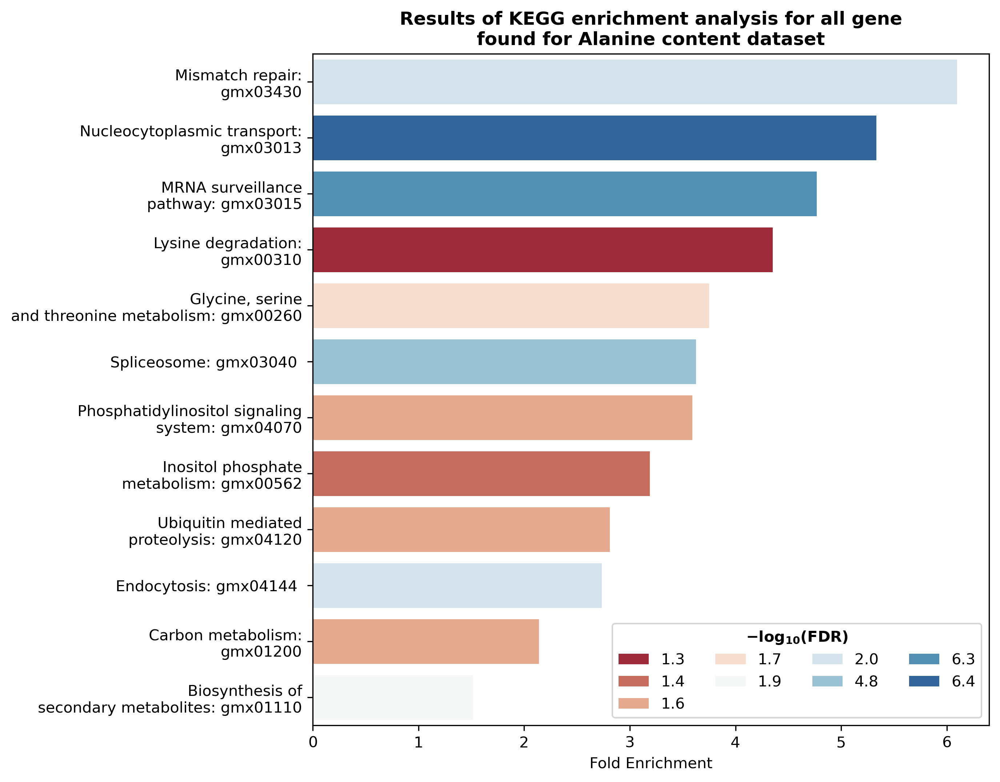

# Epistatic SNP interactions analysis using **MIDESP** algorithm 🕸️

## MIDESP algorithm

**Mutual Information-based Detection of Epistatic SNP Pairs (MIDESP)** for the detection of pairwise epistatic interactions extends mentioned mutual information-based approaches by additionally enabling the identification of epistatic interactions between *SNP pairs and quantitative phenotypes*. For this purpose, the authors adopt *the mutual information estimator* developed by Ross[^1], which accurately estimates the level of epistasis using a $k$ th-nearest neighbor-based approach. Based on entropies of variables, the mutual information between $X$ (genotype) and $Y$ (phenotype) gives the amount of information that is shared between them. In other words, *the mutual information* can be seen as a measure for the association between two variables, which includes linear as well as non-linear dependencies[^2].

Moreover, to deal with the possible obstacles inside a genotype–phenotype dataset, i.e. background associations between SNP pairs and the phenotype, [MIDESP](https://github.com/FelixHeinrich/MIDESP) method incorporates an additional step using *the average product correction (APC) theorem*[^3] to estimate the expected level of background association for each SNP pair. Finally, the removal of the estimated background from the measured epistasis values leads to the detection of correct epistatic signals arising from functional interactions.

The pipeline of the **MIDESP** is shown in the figure bellow:


As mentioned by Whang S. *et al.*, 2017[^4], to expand the analysis scope from SNPs to genes and enable better interpretation and functional validation in a network framework, we convert the constructed SNP epistasis networks into gene-gene interaction networks. Edge weights of the gene-gene interaction network are computed using the edge weights ($MI_APC$) of SNP epistasis network. As multiple SNPs can be mapped to the same gene, we need an algorithm to determine the weight between two genes given the mapped SNPs and the association strengths between them. Given multiple edge weights between SNPs belonging to two different genes, we have chosen **maximum $MI_{APC}$** value as the weight in a gene network. The illustration below shows the maon concept described above:


Also, the authors propose to calculate the number of interactions of a node (gene), which was termed its degree. Further, for the final step of building network, these degrees should be transformed into $z-scores$ and the authors consequently defined a gene as *MIDESP-significant* if its $z-score$ was $\geq 3$[^5]. We considered to perform this filtering with calculation of $z-score$ based on *the mutual information* between genes, as also proposed in other analysis[^4].

## System and requirements

This analysis was performed on Ubuntu 20.04.5 LTS with Python 3.9.13. Also, [VCFtools](https://vcftools.github.io/examples.html) v0.1.16, [BEDTools](https://anaconda.org/bioconda/bedtools) v2.30.0, [BEAGLE](http://faculty.washington.edu/browning/beagle/beagle.html) v5.4, and [MIDESP](https://github.com/FelixHeinrich/MIDESP) v1.2 should be installed. Required Python packages and their versions listed in [requirements.txt](./requirements.txt).

## Folders

Threre are **three folders**, and here is their description:

1) [Pictures](./Pictures): contains pictures used in this README.md;
2) [alanine_dataset](./alanine_dataset): contains files required or generated during analysis of *Alanine content dataset*. For example, there are **MIDESP** output, and generated for and after genome assembly remapping, SNP annotation, enrichment analysis, files for building gene-gene interacrion networks *etc.*;
3) [source](./): contains *Jupyter Notebooks* with detailed and commented analysis of both datasets, and `.py` script with useful for this analysis functions

## MIDESP parameters

For our analysis, we used parameters **recommended by authors**. The table below describes available *parameters* for running **MIDESP**:  

| **Parameter** | **Type** |                                                     **Description**                                                     |
|:-------------:|:--------:|:-----------------------------------------------------------------------------------------------------------------------:|
| -out          |   file   | name of outputfile (default tpedFile.epi)                                                                               |
| -threads      |  number  | number of threads to use (default = Number_of_Cores / 2)                                                                |
| -keep         |  number  | keep only the top X percentage pairs with highest MI (default = 1)                                                      |
| -cont         |          | indicate that the phenotype is continuous                                                                               |
| -k            |  number  | set the value of k for MI estimation for continuous phenotypes (default = 30)                                           |
| -fdr          |  number  | set the value of the false discovery rate for finding significantly associated SNPs (default = 0.005)                   |
| -apc          |  number  | set the number of samples that should be used to estimate the average effects of the SNPs (default = 5000)              |
| -list         |   file   | name of file with list of SNP IDs to analyze instead of using the SNPs that are significant according to their MI value |
| -noapc        |          | indicate that the APC should not be applied                                                                             |
| -noepi        |          | indicate that no epistatic SNP pairs should be calculated                                                               |
| -all          |          | write an additional file containing the MI values for all SNPs (outputfile.allSNPs)                                     |

## Preparation to run

For commercial dataset, before converting it to `PLINK` readable format, we imputed genotype and filered out indels from `.vcf` file with genotype data. This procedure described in this [Notebook](../AntEpiSeeker/source/AntEpiSeeker_secret.ipynb).

The **input** files should be in `PLINK` format: `.tped` for genotype and `.tfam` for phenotype. After converting them to a `PLINK` readable format, as recommended by authors, we applied several filters to the datasetwe first filtered on data: 

1) we removed SNPs with a minor allele frequency ≤0.05 (--maf 0.05);
2) a sample was removed if a phenotype was unavailable for it or if more than 5% of SNPs were missing (--prune);
3) we removed all redundant SNPs with an LD ≥0.99, and thus carrying very similar information about the phenotype (--indep-pairwise 10000 5 0.99)
4) data conteins scaffolds, we kept them using --allow-extra-chr flag;
5) --double-id to cause both family and within-family IDs to be set to the sample ID;
6) --recode transpose to make `.tped` and `.tfam` files (transposed);
7) --chr-set to specify number of chromosomes (*Glycine max* has 20 chromosomes in genome);
8) --indep-pairwise with 10000 (window size), 5 (step size (variant ct)), and 0.99 ($r^2$ threshold) for variant pruning (**values recommended by authors**)

This filtering were performed using `PLINK` v1.9[^7]. Data filtering and commands also given in **Jupyter Notebooks** in [source](./source) folder. **The example command** for *Alanine content dataset*  

```
$ ./plink --vcf ../alanine_dataset/ala_midesp_input/soybean_aa_genotypes_IDs.vcf  
        --pheno ../alanine_dataset/ala_midesp_input/soybean_aa_genotypes_IDs.vcf 
        --allow-no-sex 
        --allow-extra-chr 
        --double-id 
        --maf 0.05 
        --prune 
        --recode transpose 
        --chr-set 20 
        --out ../alanine_dataset/ala_midesp_output/ala_genotype_filtered

$ ./plink --allow-no-sex 
        --indep-pairwise 10000 5 0.99 
        --make-founders 
        --allow-extra-chr 
        --double-id 
        --chr-set 20 
        --out ../alanine_dataset/ala_midesp_output/ala_Filtered_PruneInfo 
        --tfile ../alanine_dataset/ala_midesp_output/ala_genotype_filtered

$ ./plink --allow-no-sex 
        --allow-extra-chr 
        --double-id 
        --extract ../alanine_dataset/ala_midesp_output/ala_Filtered_PruneInfo.prune.in 
        --make-founders 
        --recode transpose 
        --chr-set 20 
        --out ../alanine_dataset/ala_midesp_output/ala_Filtered_Pruned 
        --tfile ../alanine_dataset/ala_midesp_output/ala_genotype_filtered
```

Here some statistics of filtering for Alanine and Commercial phenotype datasets:

| **Dataset** | **Initial #SNPs** | **Initial #samples** | **Remained #SNPs** | **Remained #samples** |
|------|:----:|:----:|:----:|:----:|
|  alanine   |   23278 |  249 |  16552   | 248 |
|  commercial   |  37676   |  97   |  23880   |  97   |

## Running MIDESP

The **MIDESP** pipeline was implemented in *Java* and is available as a `.jar` file. The LINUX version of **MIDESP** program could be downloaded by [this link](https://github.com/FelixHeinrich/MIDESP). The compiled program file could be run as simple as `java -jar MIDESP.jar`. The following command was used in our **MIDESP** analysis **with parameters recommended by authors**:

- for Alanine content dataset:

```
$ java -jar MIDESP_1.2.jar -threads 8 -out ../alanine_dataset/ala_midesp_output/ala_Filtered_Pruned.epi 
                         -keep 0.25 -fdr 0.005 -apc 4689 -cont -k 30 
                         ../alanine_dataset/ala_midesp_output/ala_Filtered_Pruned.tped 
                         ../alanine_dataset/ala_midesp_output/ala_Filtered_Pruned.tfam
```

- for Commercial dataset:

```
java -jar MIDESP_1.2.jar -threads 8 
                         -out ../commercial_dataset/comm_midesp_input/secret_Filtered_Pruned.epi 
                         -keep 0.25 -fdr 0.005 -apc 5000 -cont -k 30 
                         ../commercial_dataset/comm_midesp_input/secret_Filtered_Pruned.tped
                         ../commercial_dataset/comm_midesp_input/secret_Filtered_Pruned.tfam
```                         

The **MIDESP** program will create three files:

1) `outputfile.sigSNPs` which contains a list of the SNPs that were found as being strongly associated to the phenotype along with their entropy and the mutual information between the SNP and the phenotype;
2) `outputfile.epi` which contains a list of the top SNP pairs that show the strongest association to the phenotype along with the mutual information between the SNP pair and the phenotype and the mutual information corrected through application of the APC theorem
For datasets with a small number of SNPs (e.g. < 5,000) it is recommended to deactivate APC with the optional parameter `-noapc`.
3) `outputfile.allSNPs` when `-all` parameter is specified to write an additional file containing the MI values for all SNPs

## MIDESP workflow

The major **MIDESP** workflow consists of this steps and were performed in Jupyter Notebook. Notebooks could be found [here](./source):

- determing SNP pairs with the top mutual information value;
- annotating found SNPs and mapping them on genes using intersection with genome annotation file
- parsing and filtering the resulted file with genome features for keeping only gene loci; 
- building gene-gene interaction network;
- analysing resulted interacting genes using GO, KEGG enrichment analysis etc.;
- analysing literature and databases of known gene-gene interactions and evaluating MIDESP results

### SNP Annotation

In the case of alanine phenotype, before generating file with coordinates we added and substract 500 basepairs from SNP coordinates and remapped them to **genome assembly v2.1** using [NCBI Feature remapping](https://www.ncbi.nlm.nih.gov/genome/tools/remap)[^8]. Also, we assaigned RefSeq ID for chromosome names as in annotation file. Then for both phenotypes, we generated `.bed` files with their coordinates. The example `.bed` file is shown below:

| **chromosome** | **start** | **stop** |    **SNP_ID**   |
|:--------------:|:---------:|:--------:|:---------------:|
| NC_016088.3    |  46191324 | 46192324 | chr_01:45320366 |
| NC_016088.3    |   981275  |  982275  | chr_01:981476   |
| NC_038245.1    |  42889006 | 42890006 | chr_09:40211862 |
| NC_038241.1    |   795502  |  796502  | chr_05:8324954  |
| NC_038253.1    |  12188095 | 12189095 | chr_17:12450639 |

We performed genomic coordinates intersection using `BEDTools` v2.30.0 [^9] with the following command and `-wao` parameters for keeping all information from both files:

- for Alanine dataset:
```
bedtools intersect -wao -a ../alanine_dataset/ala_midesp_analysis/ala_remapped_SNPs.bed -b GCF_000004515.5_Glycine_max_v2.1_genomic.gff > ../alanine_dataset/ala_midesp_analysis/ala_intersection.txt
```

- for Commercial dataset:

```
bedtools intersect -wao -a ../commercial_dataset/comm_midesp_analysis/secret_SNPs_coordinates.bed -b Glycine_max.Glycine_max_v2.1.56.gff3 > ../commercial_dataset/comm_midesp_analysis/secret_intersection.txt
```

Then we parsed the resulted file with genome features loci and filtered genes. So, this allowed us to map SNP on corresponding genes. After that, we analysed resulted genes using [ShinyGO v0.77](http://bioinformatics.sdstate.edu/go/)[^10], [bioDBnet](https://biodbnet.abcc.ncifcrf.gov/db/db2db.php)[^11], and [SoyBase](https://www.soybase.org/genomeannotation/)[^12] to determing metabolic pathways and biological processes in which the found genes are present.

## MIDESP Analysis Results

### Alanine phenotype

Running **MIDESP** for dataset with *Alanine phenotype*, **123** SNPs were found as being strongly associated to the phenotype along with their entropy and the mutual information between the SNP and the phenotype. Also, we obtained a list of the top 0,25% (**5070**) SNP pairs that show the strongest association to the phenotype along with the mutual information between the SNP pair and the phenotype and the mutual information corrected through application of the APC theorem. Among them, **2167** SNPs were unique. Then we remapped them on *Glycine max* [genome assembly v2.1](https://www.ncbi.nlm.nih.gov/assembly/GCF_000004515.5). We used `.gff` with annotation, chromosome names as RefSeq ID (start with NC_). As the result of remapping, **2132** unique SNPs were remained. After annotation and mapping, **1347** SNPs were localized in gene loci.

Before building gene-gene interaction network, we have checked if there are any mirrored SNP pairs and dropped one of them due to they are equal. For example, $(1, 2) = (2, 1)$. Also, we checked if any genes were paired with themselves. As the result, we obtained **1930** unique gene pairs. The distribution of $MI_{APC}$ for resulted gene pairs is shown below:


Further, we used [ShinyGO 0.77](http://bioinformatics.sdstate.edu/go/) webtools to perform GO and KEGG annotation for each SNP. The results of KEGG enricnment analysis shown in picture below. As we could see, some genes were found to participate in *Glycine, serine, and threonine metabolism* ([KEGG:gmx00260](https://www.genome.jp/kegg-bin/show_pathway?gmx00260)). Their GeneIDs are 100789869, 100804183, 100811186, 100805860, 100792482, and 100800811.


Next, we have normalized $\mathbf{MI_{APC}}$ scores between gene pairs and built gene-gene interaction network using edges with $z-scores \ge 2$. For this case, we decided to slightly lower the threshold to get more nodes (genes) on the network. The resulted gene-gene interaction network were based on **32** gene pairs and shown in picture below. Genes are represented by nodes, the weight of edges charachterizes the mutual information for gene pairs and their association with phenotype, and colors represent GO:Biological Processes for these genes.

**Gene-gene interaction network based on MIDEP pipeline results for Alanine dataset:**


### Commertial trait

Running **MIDESP** for dataset with *Complex Commercial phenotype*, **309** SNPs were found as being strongly associated to the phenotype along with their entropy and the mutual information between the SNP and the phenotype. Also, we obtained a list of the top 0,25% (**18328**) SNP pairs that show the strongest association to the phenotype along with the mutual information between the SNP pair and the phenotype and the mutual information corrected through application of the APC theorem. Among them, **6012** SNPs were unique. After annotation and mapping, **3181** SNPs were localized in gene loci.

Before building gene-gene interaction network, we have checked if there are any mirrored SNP pairs and dropped one of them due to they are equal. For example, $(1, 2) = (2, 1)$. Also, we checked if any genes were paired with themselves. As the result, we obtained **4362** unique gene pairs. The distribution of $MI_{APC}$ for resulted gene pairs is shown below:


Further, we used [ShinyGO 0.77](http://bioinformatics.sdstate.edu/go/) webtools to perform GO and KEGG annotation for each SNP. The results of KEGG enricnment analysis shown in picture below. As we could see, found genes participate in some major metabolic pathways, such as DNA repare, nucleocytoplasmic transport, amino acid metabolism, cell signaling etc. This results were expected for the development of complex phenotypic trait. 



The resulted gene-gene interaction network were built based on **63** gene pairs and shown in picture below. Genes are represented by nodes, the weight of edges charachterizes the mutual information for gene pairs and their association with phenotype, and colors represent GO:Biological Processes for these genes.

**Gene-gene interaction network based on MIDEP pipeline results for Commercial dataset:**


## Setup

To reproduce the analysis described here, use this [README.md](./README.md), Jupyter Notebooks from [source](./folder), and also:

1. Install [Anaconda](https://docs.anaconda.com/anaconda/install/index.html) if not already installed;
2. Create virtual environment via conda using [requirements.txt](./requirements.txt) file with dependences;

```$ conda create --name <env_name>```

3. Activate it;

```$ conda activate <env_name>```

4. Install necessary libraries;

```$ pip3 install -r requirements.txt```

5. Install necessary tools: 

- [VCFtools](https://vcftools.github.io/examples.html) v0.1.16;
- [BEDTools](https://anaconda.org/bioconda/bedtools) v2.30.0;
- [BEAGLE](http://faculty.washington.edu/browning/beagle/beagle.html) v5.4;
- [MIDESP](https://github.com/FelixHeinrich/MIDESP) v1.2

## References

[^1]: Ross, B. C. (2014). Mutual information between discrete and continuous data sets. PloS One, 9(2), e87357. doi:10.1371/journal.pone.0087357
[^2]: Heinrich, F., Ramzan, F., Rajavel, A., Schmitt, A. O., & Gültas, M. (2021). MIDESP: Mutual information-based detection of epistatic SNP pairs for qualitative and quantitative phenotypes. Biology, 10(9), 921. doi:10.3390/biology10090921
[^3]: Dunn, S. D., Wahl, L. M., & Gloor, G. B. (2008). Mutual information without the influence of phylogeny or entropy dramatically improves residue contact prediction. Bioinformatics (Oxford, England), 24(3), 333–340. 
[^4]: Wang, S., Jeong, H.-H., Kim, D., Wee, K., Park, H.-S., Kim, S.-H., & Sohn, K.-A. (2017). Integrative information theoretic network analysis for genome-wide association study of aspirin exacerbated respiratory disease in Korean population. BMC Medical Genomics, 10(Suppl 1), 31. doi:10.1186/s12920-017-0266-1
[^5]: Meckbach, C., Tacke, R., Hua, X., Waack, S., Wingender, E., & Gültas, M. (2015). PC-TraFF: identification of potentially collaborating transcription factors using pointwise mutual information. BMC Bioinformatics, 16(1), 400. doi:10.1186/s12859-015-0827-2
[^6]: Danecek, P., Auton, A., Abecasis, G., Albers, C. A., Banks, E., DePristo, M. A., … 1000 Genomes Project Analysis Group. (2011). The variant call format and VCFtools. Bioinformatics (Oxford, England), 27(15), 2156–2158. doi:10.1093/bioinformatics/btr330
[^7]: Purcell, S., Neale, B., Todd-Brown, K., Thomas, L., Ferreira, M. A. R., Bender, D., … Sham, P. C. (2007). PLINK: a tool set for whole-genome association and population-based linkage analyses. The American Journal of Human Genetics, 81(3), 559–575. doi:10.1086/519795
[^8]: https://www.ncbi.nlm.nih.gov/genome/tools/remap
[^9]: Quinlan, A. R., & Hall, I. M. (2010). BEDTools: a flexible suite of utilities for comparing genomic features. Bioinformatics (Oxford, England), 26(6), 841–842. doi:10.1093/bioinformatics/btq033
[^10]: Ge, S. X., Jung, D., & Yao, R. (2020). ShinyGO: a graphical gene-set enrichment tool for animals and plants. Bioinformatics (Oxford, England), 36(8), 2628–2629. doi:10.1093/bioinformatics/btz931
[^11]: Mudunuri, U., Che, A., Yi, M., & Stephens, R. M. (2009). bioDBnet: the biological database network. Bioinformatics (Oxford, England), 25(4), 555–556. doi:10.1093/bioinformatics/btn654
[^12]: Grant, D., Nelson, R. T., Cannon, S. B., & Shoemaker, R. C. (2010). SoyBase, the USDA-ARS soybean genetics and genomics database. Nucleic Acids Research, 38(Database issue), D843-6. doi:10.1093/nar/gkp798
