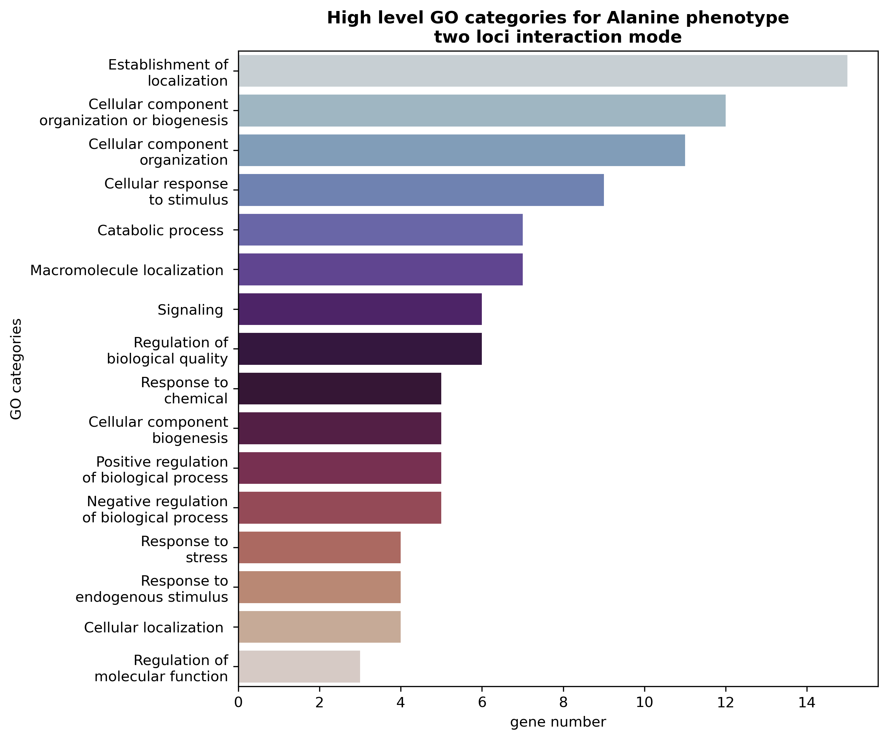
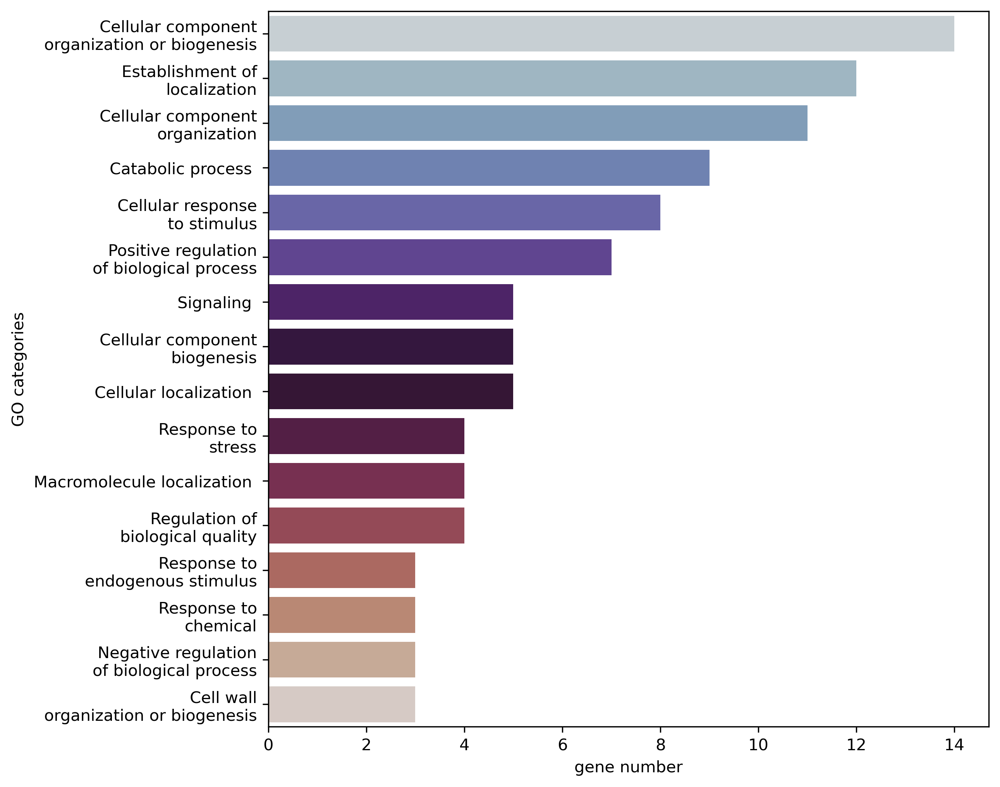
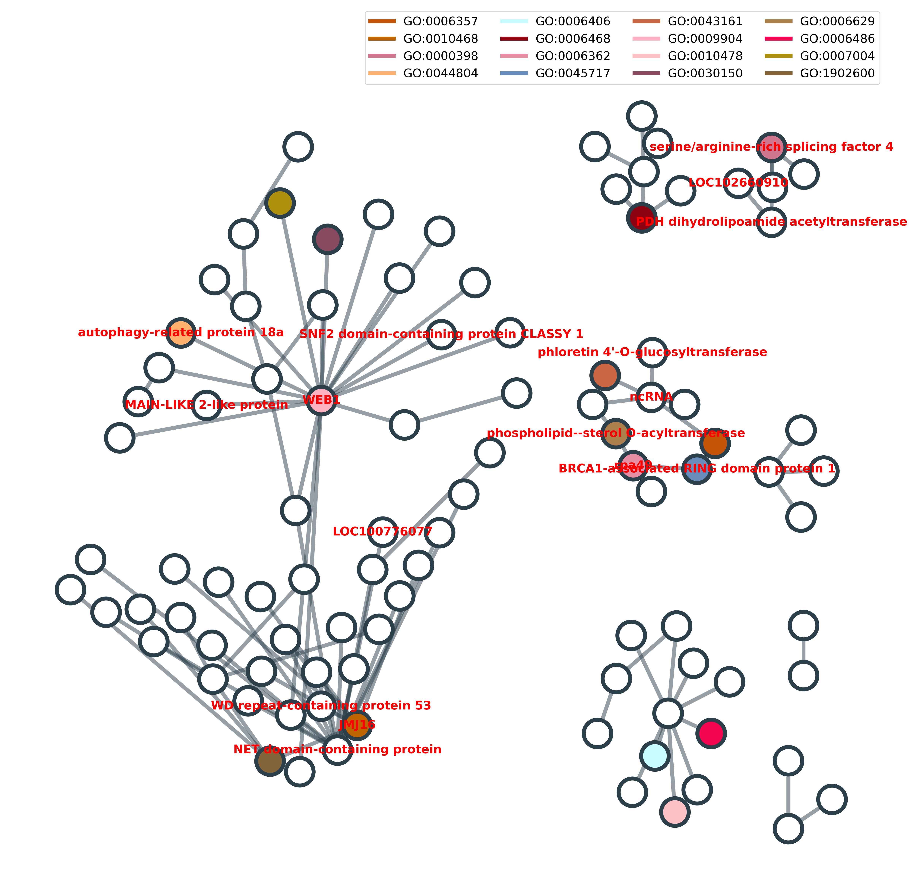
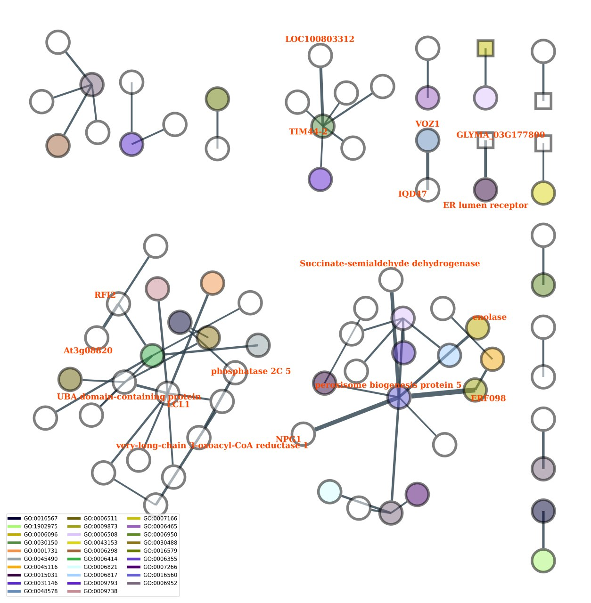

#   SNP Grouping and evaluation of epistatic interaction for phenotypic traits in agricultural plants 

## Disclamer
This Repository is for **Semester project in Bioinformatics Institute 2022-2023**. In this project, we analyzed both open-access and NOVA PLANT commercial datasets, thus the part with commercial raw data as well as the results of analysis  are contained in private repository. There are raw data and utilities' outputs only for open-access dataset. 

## Authors:raising_hand::
* Anastasia Zolotar
* Ann Balan 
* Sergei Volkov

## Introduction 🍃
Epistasis is the phenomenon where the effect of one SNP on a trait depends on the genotype at other loci. Epistatic interaction between SNPs can help us to understand the genetic basis of complex traits and diseases and improve genome analysis, such as GWAS analysis [^1].

Researching epistatic interactions between SNPs is particularly important in agriculture technologies for two linked reasons: plants are often exposed to a wide range of environmental conditions, and complex genetic mechanisms underlying stress tolerance often involve multiple genes and pathways.

Additionally, identifying epistatic interactions between SNPs in plants can help to elucidate the complex genetic pathways underlying stress responses, and identify new targets for crop improvement. For example, identifying epistatic interactions between SNPs involved in photosynthesis, water use efficiency, and stress signaling pathways could provide insights into how plants respond and adapt to environmental stresses like drought, heat, and cold.

In recent years numerous algorithms have been proposed for epistasis analysis. High-order SNP interactions detection approaches can be grouped into four categories: exhaustive, heuristic, stepwise, or machine learning based search [^3]. Among a wide variety of algorithms for our task we decided to test those based on linear models (SNPHarvester [^4], martini [^5], MACARON [^6], and WISH-R [^7]), on a Bayesian computational method with a Metropolis-Hastings algorithm (BHIT [^8]), on an ant colony optimization (ACO) algorithm (AntEpiSeeker [^9]), and on a calculation of a mutual information (SHESisPlus [^10] and MIDESP [^11]). There have been detailed descriptions in the literature for the usage of these utilities, and some of them are considered reference for this task.

As for further analysis of the epistasis data obtained, for example, the literature describes the approach based on building a gene-gene interaction network using interactions of SNP pairs. It is possible to identify those genes that have the greatest number of links with others and to modify these genes in the first place. By modifying several significant genes at once, it is possible to change complex traits. Such data can also help to identify the most promising lines and varieties. If an organism has a large number of genes from such a graph, the phenotypic trait is brighter or most likely to show up. This approach will be of great use to breeders [^2].

## Aim and objectives

In this work, we aimed to find a software and workflow for grouping single nucleotide polymorphisms (SNPs) based on their association with a quantitative trait and performing epistatic analysis. To achieve this goal, we utilized free-access data on the alanine content of soybeans *Glycine max*, as well as a dataset with some complex phenotypic trait (Nova Plant commercial property).

Soybean is not only a grain crop but also a commercial crop. It is the largest oil seed crop in the world and one of the greatest resources of plant protein. Epistasis interaction is common and can influence quantitative traits, such as oil or protein content or photosynthesis efficiency [^12].

**Objectives**:

* perform the literature analysis;
* choose the best tools and algorithms for our goal;
* preprocess our data and apply the tools;
* analyze the output, annotate each SNP and mape them on gene regions;
* visualize gene-gene interactions and possibly the interaction of bioligical processes or metabolic pathways, i.e. using graph approaches

## Datasets

During our study, we was dealing with and carried out all the tool tests using two datasets for *Glycine max* (soybean): an open-acess [data](https://www.frontiersin.org/articles/10.3389/fpls.2022.859109/full) [^13] of **the amino acid content** in the beans from an article, and with a commercial dataset, which is currently being worked on in the company. It contains **a complex quantitative phenotypic trait**. This data is a trade secret of the company. For both datasets, the initial genotype data was in *variant calling format* (`.vcf`). In the *table* bellow we summarized some statistics for both datasets:  

| **Dataset properties** | **Free-access dataset** | **Commercial dataset**    |
|--------------------|:-------------------:|:---------------------:|
| # SNPs               | 23278               | 37676                 |
| # Samples            | 249                 | 97                    |
| Phenotype          | a/a concentrations  | Unknown complex trait |

## Repository structure

This repository contains folders named by the main utility used for analysis of *Glycine max* datasets. In this folders there are lots of information about performed analysis with detailed README.md and Notebooks, system and tools requirements. Also there are [annotation](./annotation) folder with the *Glycine max* genome assembly annotations used in our analysis. Also you may download them from [NCBI](https://www.ncbi.nlm.nih.gov/assembly/GCF_000004515.5) and [EnsemblePlants](https://plants.ensembl.org/Glycine_max/Info/Index) for *Alanine content* and *Commercial datasets*, respectively. In [data](./data) folder we have collected the initial data with *the phenotype and genotype* ONLY for open-access dataset.

## The tools

In our review we have found information on more than 22 tools for this task. We identified those that seemed to be the most suitable. The most convenient were MIDESP, AntEpiSeeker, Martini, SHEsisPlus

You can see the full table with more information here:
[The table](https://www.notion.so/3bd9bcf085dd42ef8317192b854f70a8?v=f7eb1a71f8184d7a94c25d45cffa926e)

| Tool                                                          | Base                              | Traits                 | Algorythm                                                                                                               
|---------------------------------------------------------------|-----------------------------------|------------------------|-------------------------------------------------------------------------------------------------------------------------------|
| MIDESP                                                        | Java                              | Quantitative           | Entropy-based algorithm to detect epistasis                                                                             
| Martini                                                       | C++, R package                    | Quantitative, discrete | GLM                                                                                                                     
| AntEpiSeeker                                                  | bash                              | binary                 | Ant colony optimization (ACO) algorithm                                                                                 
| SHEsisPlus                                                    | online, polyploid                 | Quantitative           | Entropy-based algorithm to detect epistasis                                                                             
| WISH                                                          | Python, R package                 | Quantitative, binary   | Parallelized efficient linear model and generalized linear model implementations                                         
| BHIT                                                          | Python                            | Quantitative, discrete | MCMC                                                                                                                     
**The most valuable results** of SNPs interactions were the ones obtained by utilizing **AntEpiSeeker** [^9] and **MIDESP** [^11] in a sense of: 
1) analysis potential; 
2) amount of received data; 
3) successful launch;
4) time consumption and efficiency;
5) ease of installation;
6) detailed analysis pipline

### Other tools

Other tools can be useful as well, but they didn't fit our requirements and goals, that is why *the results obtained by these tools not dicussed in the main project READNE.md*, however you can take a look on other respective folders for more information about them and some pieces of code that can help you with the input and getting the result.

Some tools gave us an output which was hard to operate with. For example, *Martini* gave an output in a graph format, which was inconvenient to use. We saved the result though and represented it in this repository. *WISH-R* crashed on both of our datasets, as it is unable to perform analysis on a big amount of data. Same happened to *SHEsisPlus*. However, they might be useful on a little dataset or batches of data, and we hope some instructions from this repository will help you to use them.

## AntEpiSeeker
(Check out the [AntEpiSeeker](./AntEpiSeeker) folder for more)

**Ant colony algorithms**, proposed first by Dorigio and Gambardella, are tools to solve difficult optimization problems [^5]. In ACO, artificial ants work as parallel units that communicate through a probability distribution function (PDF), which is updated by weights or pheromones. The change in pheromones is determined by some type of expert knowledge. As the PDF is updated, "paths" that perform better will be sampled at higher rates by subsequent artificial ants, and in turn deposit more pheromones.

1. AntEpiSeeker has been developed to search for epistatic interactions in large-scale association studies. 
AntEpiSeeker searches SNP sets of sufficient size using the ACO.
2. The second stage of AntEpiSeeker conducts exhaustive search of epistatic interactions within the highly suspected SNP sets, and within the reduced set of SNPs with top ranking pheromone levels. 

For more information about `AntEpiSeeker` algorithm and our analysis, see this [README.md](./AntEpiSeeker/README.md), [the authors article](https://bmcresnotes.biomedcentral.com/articles/10.1186/1756-0500-3-117) and their [website](http://nce.ads.uga.edu/~romdhane/AntEpiSeeker/index.html).

#### Alanine content results
Running AntEpiSeeker in *two-loci interaction mode*, we found *96* interacting SNP pairs. After annotating and mapping on genome, we obtained *137* SNPs localized in gene loci*. As the result of analysis, we identified *42 gene pairs* with probable epistatic interactions.

As the result of Gene Ontology (GO) and Kyoto Encyclopedia of Genes and Genomes (KEGG) annotation using [ShinyGO 0.77](http://bioinformatics.sdstate.edu/go/) webtool, we found two genes associated with Glycine, serine and threonine metabolism ([KEGG:gmx00260](https://www.genome.jp/kegg-bin/show_pathway?gmx00260)). They are peroxisomal betaine-aldehyde dehydrogenase (BADH1) and chloroplastic D-3-phosphoglycerate dehydrogenase (LOC100808771). They probably interact with long non-coding RNA (lncRNA) with unknown function (LOC102663503) and mitochondrial inner membrane protein OXA1 isoform X1 (LOC100787806), respectively. 

For all of the found genes, we analysed **High level GO terms**:

During analysis in *three-loci interaction mode*, we found *8 interacting SNP triplets*. *11 SNPs* from them were localized in the gene loci. We identified only one gene triplet with probable epistatic interactions and available information in genome annotation about all three of them (LOC100817780, LOC100789887, LOC100798041).

Further, we used [ShinyGO 0.77](http://bioinformatics.sdstate.edu/go/) webtools to perform GO and KEGG annotation for found genes. As a result, we found only one gene associated with Glycine, serine and threonine metabolism (). Also one of the genes that was found is 1-aminocyclopropane-1-carboxylate oxidase (LOC100814810), which is involved in Glycine, serine and threonine metabolism ([KEGG:gmx00260](https://www.genome.jp/kegg-bin/show_pathway?gmx00260)). It might interact with previously undescribed genes or non-genic regions. The results are shown in the table below.

**The results of KEGG enrichment analysis for Alanine content dataset and three-loci interaction mode**:

#### Commercial trait results
Analyzing the dataset with *commercial phenotypic trait* in *two-loci interaction mode*, we found *198* interacting SNP pairs. After annotating and mapping, we obtained *181* SNPs localized in gene loci. As a result, we identified *42 gene pairs* with probable epistatic interactions. In our opinion, the most noticeable gene interactions for development of complex phenotypic trait are those involved in *cell signaling*, *response to stress*, *circadian rhythm*, *etc.* Also, we found *two gene triplets* in *three-loci interaction mode*. Genes from these triplets are involved in *multiple signaling pathways*, *circadian rhythm*, and *transcription*.

**Commercial trait** high level GO terms (two-loci interaction mode):

#### Limitations

In general, the `AntEpiSeeker` algorithm seems to be convenient for SNP epistasis analysis in agricultural plants. The worst *limitation of this algorithm* is the need to convert quantitative phenotype into a qualitative one, which could drastically affect the results of analysis. In future plans, we would like to expand `AntEpiSeeker` functionality to process continuous phenotypic traits.

## MIDESP
(Check out the [MIDESP](./MIDESP) folder for more)

**Mutual Information-based Detection of Epistatic SNP Pairs (MIDESP)** for the detection of pairwise epistatic interactions extends mentioned mutual information-based approaches by additionally enabling the identification of epistatic interactions between *SNP pairs and quantitative phenotypes*. For this purpose, the authors adopt *the mutual information estimator* developed by Ross [^14], which accurately estimates the level of epistasis using a $k$th-nearest neighbor-based approach. Based on entropies of variables, the mutual information between $X$ (genotype) and $Y$ (phenotype) gives the amount of information that is shared between them. In other words, *the mutual information* can be seen as a measure for the association between two variables, which includes linear as well as non-linear dependencies [^11]. It also normalises the mutual information values, and corrects them with *APC* (the average product correction) to reduce background or noise interactions.

For more information about **MIDESP**, see respective [README.md](./MIDESP/README.md), [the authors article](https://www.mdpi.com/2079-7737/10/9/921) and their [Github repository](https://github.com/FelixHeinrich/MIDESP).

### Key results

Following a pipeline proposed by the **MIDESP** [^11] authors, for the *alanine content* and *commercial datasets*, firstly, *123* and *309* SNPs, respectively, were found as being strongly associated to the phenotype along with their mutual information between the SNP and the phenotype. Secondly, as recommended by the authors, we obtained a set of the top 0,25% SNP pairs (*5070 and 18328 for alanine and commercial*, composed of 2167 and 6012 SNPs, respectively) that show the strongest association with the phenotype along with the highest mutual information between the SNP pair and the phenotype.

Further, for both datasets we annotated obtained SNPs and mapped them to genes. As a result, *1347* and *3181* SNPs were localized in gene loci. The **MIDESP** pipeline allows us to build a gene-gene interaction network based on the mutual information between SNP pairs and phenotype. Prior to *building a gene-gene interaction network*, we have checked if there are any mirrored SNP pairs and dropped one of them due to their equality. We obtained *1930 unique gene pairs for the alanine content dataset* and *4362 for the commercial one*. 

Next, we have calculated $z-scores$ of APC-normalized mutual information values between gene pairs and phenotype and built a gene-gene interaction network using edges with $z-scores \ge 3$ [^15]. Final networks were built from *32* and *63 gene pairs* for *the alanine content* and *commercial datasets*, respectively. 

For *the alanine content dataset*, some genes were found to participate in *Glycine, serine, and threonine metabolism* ([KEGG:gmx00260](https://www.genome.jp/kegg-bin/show_pathway?gmx00260)). For *the commercial complex phenotype*, there were lots of genes involved in *the major metabolic pathways*, such as *DNA repair*, *nucleocytoplasmic transport*, *amino acid metabolism*, *cell signaling*, *circadian rhythm*, *stress response*, *etc.* These results could be expected for the development of complex phenotypic trait.

The pictures above representes the resulted gene-gene interaction networks for *Alinine content* and *Commecial* datasets. The nodes of these graphs are genes, the values of normalized $MI_{APC}$ are shown as the weight of the edges. We also visualized names of the top 10 interacting gene pairs. The color of nodes is assigned by biological processes in which these genes is known to participate.

**Gene-gene interaction network based on MIDEP pipeline results for *Alanine content dataset***
($MI_{APC} z-score >= 2$):

**Gene-gene interaction network based on MIDEP pipeline results for *Commercial dataset***
($MI_{APC} z-score >= 3$):

## Conclusions

This topic is just gaining attention, and is relevant for general analysis of omics data. In the course of this work, we analysed various tools for grouping SNPs. In our opinion, among tested softwares and pipelines, the **MIDESP** [^11] is the most convenient for SNPs epistatic interaction analysis of agricultural plants. *The main advantages of this pipeline* are: 1) simple installation and utilization; 2) fast processing of large amounts of data; 3) presence of a mode for a quantitative phenotype analysis; 4) possibility of building a high-order gene-gene interaction networks based on the mutual information between SNP pairs and the phenotype; and 5) quickly analyse large datasets. The results allowed us to construct interaction graphs of soybean genes which will help the Nova Plant company to work on this crop in the future.

## Plans
We are planning to create our own handy and easy-to-use pipeline or tool for analyzing the data, implementing other omics resources and visualizing results as a system of graphs.

For binary phenotypic traits, many tools have been developed to help with this kind of analysis. But it is much more difficult with continuous traits, which are particularly present in plants (protein content, degree of resistance to pathogens, yield, etc.). Few tools can perform this kind of analysis for continuous traits.

## References

<a href="https://www.flaticon.com/free-icons/cryptocurrency" title="cryptocurrency icons">Cryptocurrency icons created by Vitaly Gorbachev - Flaticon</a>

[^1]: Niel, C., Sinoquet, C., Dina, C. and Rocheleau, G. (2015). A survey about methods dedicated to epistasis detection. Frontiers in Genetics, 6. doi:https://doi.org/10.3389/fgene.2015.00285.

[^2]: Janick, J. (2001). Plant Breeding Reviews, Volume 21. [online] Google Books. John Wiley & Sons. Available at: https://books.google.ru/books?hl=ru&lr=&id=shbmDigtiqkC&oi=fnd&pg=PA27&dq=epistasis+in+plants&ots=4RoOja4c0Y&sig=WPmV9szax3v4xx5UQR3Y8-P72fs&redir_esc=y#v=onepage&q=epistasis%20in%20plants&f=false [Accessed 20 May 2023].

[^3]: Upton, A., Trelles, O., Cornejo-García, J.A. and Perkins, J.R. (2016). Review: High-performance computing to detect epistasis in genome scale data sets. Briefings in Bioinformatics, [online] 17(3), pp.368–379. doi:https://doi.org/10.1093/bib/bbv058.

[^4]: Yang, C., He, Z., Wan, X., Yang, Q., Xue, H. and Yu, W. (2008). SNPHarvester: a filtering-based approach for detecting epistatic interactions in genome-wide association studies. Bioinformatics, 25(4), pp.504–511. doi:https://doi.org/10.1093/bioinformatics/btn652. 

[^5]: Chloé-Agathe Azencott and Héctor Climente-González (2021). martini: an R package for genome-wide association studies using SNP networks. doi:https://doi.org/10.1101/2021.01.25.428047.

[^6]: Khan, W., Ganapathi Varma Saripella, Ludwig, T., Cuppens, T., Florian Thibord, Emmanuelle Génin, Jean-François Deleuze and David-Alexandre Trégouët (2018). MACARON: a python framework to identify and re-annotate multi-base affected codons in whole genome/exome sequence data. 34(19), pp.3396–3398. doi:https://doi.org/10.1093/bioinformatics/bty382.

[^7]: Kadarmideen, H.N. and Adriano, V. (2021). Protocol for Construction of Genome-Wide Epistatic SNP Networks Using WISH-R Package. pp.155–168. doi:https://doi.org/10.1007/978-1-0716-0947-7_10.

[^8]: Wang, J., Joshi, T., Babu Valliyodan, Shi, H., Liang, Y., Nguyen, H.T., Zhang, J. and Xu, D. (2015). A Bayesian model for detection of high-order interactions among genetic variants in genome-wide association studies. BMC Genomics, 16(1). doi:https://doi.org/10.1186/s12864-015-2217-6.

[^9]: Wang, Y., Liu, X., Robbins, K. and Rekaya, R. (2010). AntEpiSeeker: detecting epistatic interactions for case-control studies using a two-stage ant colony optimization algorithm. BMC Research Notes, 3(1). doi:https://doi.org/10.1186/1756-0500-3-117.

[^10]: Shen, J.-W., Li, Z., Chen, J., Song, Z., Zhou, Z. and Shi, Y. (2016). SHEsisPlus, a toolset for genetic studies on polyploid species. Scientific Reports, 6(1). doi:https://doi.org/10.1038/srep24095.

[^11]: Heinrich, F., Ramzan, F., Rajavel, A., Schmitt, A.O. and Gültas, M. (2021). MIDESP: Mutual Information-Based Detection of Epistatic SNP Pairs for Qualitative and Quantitative Phenotypes. Biology, 10(9), p.921. doi:https://doi.org/10.3390/biology10090921.
‌
[^12]:Correction: SNP-SNP Interaction Analysis on Soybean Oil Content under Multi-Environments. (2016). PLOS ONE, 11(12), p.e0169222. doi:https://doi.org/10.1371/journal.pone.0169222.
‌
[^13]: Singer, W.M., Shea, Z., Yu, D., Huang, H., Mian, M.A.R., Shang, C., Rosso, M.L., Song, Q.J. and Zhang, B. (2022). Genome-Wide Association Study and Genomic Selection for Proteinogenic Methionine in Soybean Seeds. Frontiers in Plant Science, 13. doi:https://doi.org/10.3389/fpls.2022.859109.

[^14]: Ross, B. C. (2014). Mutual information between discrete and continuous data sets. PloS One, 9(2), e87357. doi:10.1371/journal.pone.0087357.

[^15]: Wang, S., Jeong, H., Kim, D., Wee, K., Park, H.-S., Kim, S.-H. and Sohn, K.-A. (2017). Integrative information theoretic network analysis for genome-wide association study of aspirin exacerbated respiratory disease in Korean population. BMC Medical Genomics, 10(S1). doi:https://doi.org/10.1186/s12920-017-0266-1.
